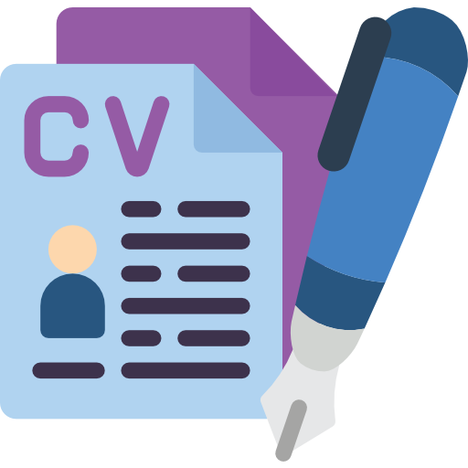

### 👋 Kawã Campos - Full-Stack Developer

### 📖 About Me
I am a Computer Science student with a passion for web development and creating user-friendly interfaces. I am currently in my first semester of studies and committed to enhancing my skills through courses and hands-on projects. My goal is to become a skilled front-end developer and contribute to the creation of amazing web experiences.
 

 
  

### ☣️ More About Me

<ul>🚀 Skills:
 <li> HTML5, CSS3, and JavaScript: Proficient in building responsive and visually appealing web interfaces.</li>
 <li> React and Redux: Currently learning and expanding knowledge in creating dynamic and interactive front-end applications.</li>
 <li> Node.js and Express: Currently learning and exploring server-side development and building RESTful APIs.</li>
 <li> MongoDB: Currently learning and gaining familiarity with NoSQL databases for data storage and retrieval.</li>
 <li> Design Patterns: Currently studying and understanding commonly used software design principles and patterns.</li>
 <li> English Fluency: Fluent in English, with strong written and verbal communication skills.</li>
</ul>

## 📚 Education
**Bachelor of Computer Science** | Cruzeiro do Sul University | 2023 - Present
 

### 📊 Github Stats

  <table>
    <tr>
        <td></td>
        <td></td>
    </tr>   
  </table>

  

### 🌱 Ongoing Course:
I am taking a web development course with a focus on JavaScript and TypeScript. The course covers front-end and back-end (Full Stack) topics using Node.js, Express, noSQL, React, hooks, Redux, and Design Patterns. I have completed 6% of the course, which has a total duration of 146 hours.

🐍 Interest in Python:
I also have an interest in Python and I am actively seeking knowledge to expand my skill set.

### 💼 Work Experience: 
I have previous experience as a cashier at McDonald's and as a kitchen assistant at Cabana Burguer. However, my main focus is in the development field.
 
 

  <table>
    <tr>   
         

        </td>
         <td>
            <b>📞 Contact :</b>
          

              
                          

        </td>
          <td>
           <b>📝Resume :</b>
           

             
          

       </td>
     </tr>   
  </table>

